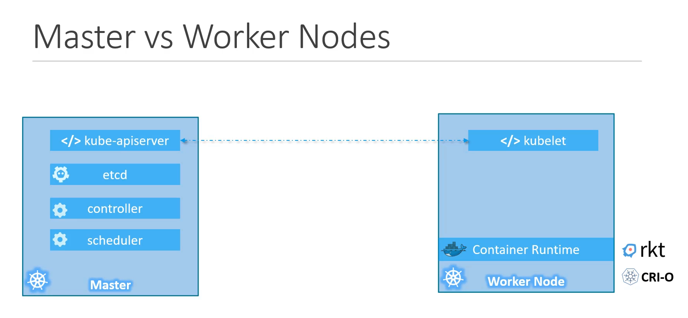

# Kubernetes CKAD

## Table of Contents

- Kubernetes Architecture

## Kubernetes Architecture

### Nodes

- A node is a machine - physical or virtual - on which Kubernetes is installed. Also known as a minions in the past.
- Cluster is made up of multiple nodes.

  - Sharing load
  - High availability: if one node goes down another node can take over.

- Master
  Master is another node where kubernetes installed and it is configured as master. It is responsible for managing the cluster.

### Components

- **API Server**: The API server act as frontend for kubernetes. Users, management devices, command line interfaces all talk to the API server to interact with the kubernetes cluster. The API server is responsible for processing and validating rest requests, updating the etcd data store, and updating the state of the cluster.

- **etcd**: A consistent and highly-available key value store used as Kubernetes' backing store for all cluster data. etcd responsible for implementing locks within the cluster to ensure that only one process can access a resource at a time.

- **Scheduler**: The scheduler is responsible for distributing work or containers across multiple nodes. It looks for newly created containers and assigns them to nodes.

- **Controllers**: The controllers are the brain behind orchestration. They are responsible for noticing and responding when nodes, containers, or endpoints go down. They make decisions to bring up new containers in such cases.

- **Container Runtime**: The container runtime is the software that is responsible for running containers. Kubernetes supports several container runtimes: Docker, containerd, CRI-O, and any implementation of the Kubernetes CRI (Container Runtime Interface).

- **Kubelet**: An agent that runs on each node in the cluster. It makes sure that containers are running in a pod.

### Master Node vs Worker Node

### kubectl

- `kubectl` is a command line interface for running commands against Kubernetes clusters.
- `kubectl` is used to deploy applications, inspect and manage cluster resources, and view logs.

## Docker vs Containerd

Container Runtime Interface (CRI) is a plugin interface which enables kubelet to use a wide variety of container runtimes, without the need to recompile. CRI allowed any vendor to work as a container runtime for Kubernetes as long as they adhere to OCI standards.
OCI (Open Container Initiative) consist of an image spec and runtimespec. The image spec defines the format of the container image, while the runtime spec defines the format of the runtime bundle.

- **Docker**: Docker is a platform for developing, shipping, and running applications in containers. Docker is a container runtime that uses containerd to manage container lifecycle.

- **Containerd**: Containerd is an industry-standard core container runtime. It is available as a daemon for Linux and Windows, which can manage the complete container lifecycle of its host system: image transfer and storage, container execution and supervision, and low-level storage and network attachments.
